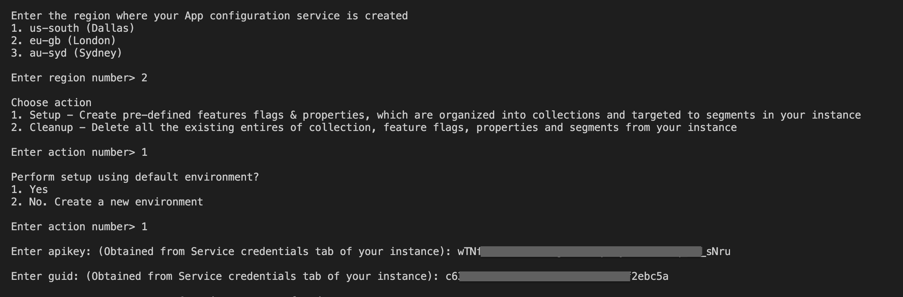

# Node.js Sample Application for IBM Cloud App Configuration service
> **DISCLAIMER**: This is a guideline sample application and is used for demonstrative and illustrative purposes only. This is not a production ready code.

This sample contains an Node.js microservice that you can use to learn more about the IBM Cloud App Configuration service.

## Contents
  - [Prerequisite](#prerequisite)
  - [Create an instance of App Configuration service](#create-an-instance-of-app-configuration-service)
  - [Setup the app](#setup-the-app)
    - [Prerequisites](#prerequisites)
    - [Next steps](#next-steps)
  - [Run the app locally](#run-the-app-locally)
  - [Test the app with feature toggle and segmentation](#test-the-app-with-feature-toggle-and-segmentation)
- [License](#license)

## Prerequisite

- You need an [IBM Cloud](http://cloud.ibm.com/) account. If you don't have an account, create one [here](https://cloud.ibm.com/registration/).

## Create an instance of App Configuration service
- Log in to your IBM Cloud account.
- In the [IBM Cloud catalog](https://cloud.ibm.com/catalog#services), search **App Configuration** and click [App Configuration](https://cloud.ibm.com/catalog/services/app-configuration). The service provisioning page opens.
- **Select a region** - Currently, Dallas (us-south), London (eu-gb) and Sydney (au-syd) regions are supported.
- Select a pricing plan, resource group and configure your resource with a service name, or use the preset name.
- Click **Create**. A new service instance is created and the App Configuration dashboard is displayed.

## Setup the app
## Prerequisites
- Node.js installed on your machine.
- jq - command-line JSON processor. Install it from [here](https://stedolan.github.io/jq/download/).

## Setup the App Configuration service instance
- Download the source code
    ```
    $ git clone https://github.com/saikumar1607/shopping-website.git
    $ cd shopping-website
    ```
- Install `jq` - command-line JSON processor.
    - You can install it from [here](https://stedolan.github.io/jq/download/)
- 
- Go to dashboard of your App Configuration instance in IBM Cloud UI.
- Navigate to Service Credentials section and generate a new set of credentials. Note down the `region`, `guid` and `apikey`. These credentials are required in the next steps.
- From your terminal, inside the source code execute the `demo.sh` script by running below command
    ```bash
    $ ./demo.sh
    ```
    > If you face any permission errors during the script execution, provide appropriate permission to the file by running - `sudo chmod 777 ./demo.sh`. And then execute the script.  
- Provide all the inputs during script execution. A sample example is shown in below figure
  
- Script execution takes time. Script is executed successfully only when you see the log `---Demo script complete---` at the end in your terminal.
- This script will create the collections, feature flags, properties & segments using the default dev environment in the instance which are required for this sample app.

## Run the sample
- Prerequisites
    - Node.js installed on your machine.
- Edit the configuration values in file [`server.js`](server.js)
    - Replace `region`, `guid` & `apikey` at [line 21](server.js#L21) with the values you obtained from the Service credentials section of the App Configuration service instance.
- Installing Dependencies
    - Run `npm install` from the root folder to install the app’s dependencies.
- Run `npm start` to start the app
- Access the running app in a browser at http://localhost:3000


## Use cases
- Keep the app running. From the App Configuration service instance dashboard, navigate to Feature flags section.
- Turn ON the toggle for `Flash sale banner` feature flag. Once turned ON, refresh your app running on localhost:3000. You will observe a banner image added on top of your homepage. And when the toggle is turned OFF, the banner image disappears or is removed from the home page.
- `Flash sale date` property will act in synchronized with feature flag - `Flash sale banner`. The numeric property value is displayed as date on banner image.
- Similarly turn ON the toggle for `Bluetooth earphones` feature flag & refresh the running app. Since this feature flag is targeted to segment - `Bluetooth earphones segment`, all the bluetooth earphones items are listed in the homepage only when the app is accessed between 10am to 12pm local time.

# License
Copyright 2021 IBM Corp.

Licensed under the Apache License, Version 2.0 (the "License");
you may not use this file except in compliance with the License.
You may obtain a copy of the License at  [http://www.apache.org/licenses/LICENSE-2.0](http://www.apache.org/licenses/LICENSE-2.0)
unless required by applicable law or agreed to in writing, software
distributed under the License is distributed on an "AS IS" BASIS,
WITHOUT WARRANTIES OR CONDITIONS OF ANY KIND, either express or implied.
See the License for the specific language governing permissions and
limitations under the License.

See [here](https://cloud.ibm.com/docs/app-configuration) for detailed docs on App Configuration service.